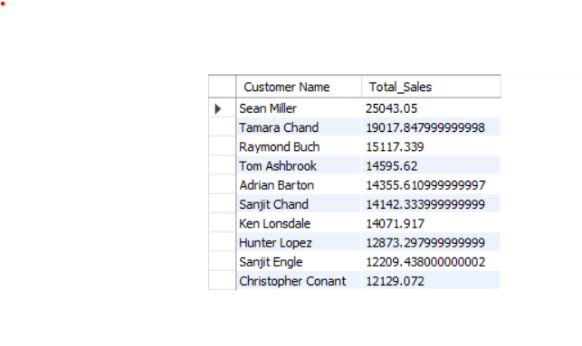
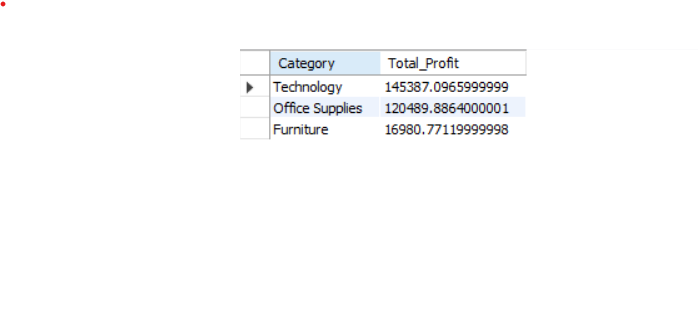
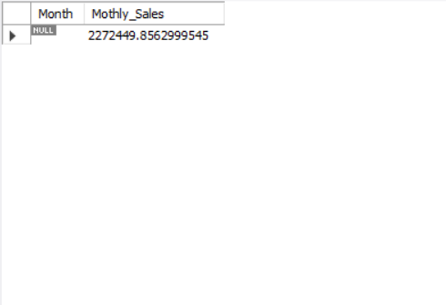
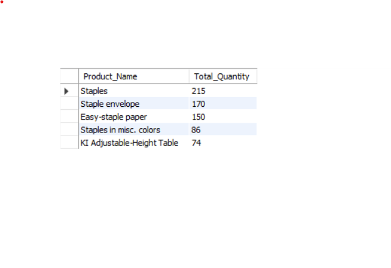
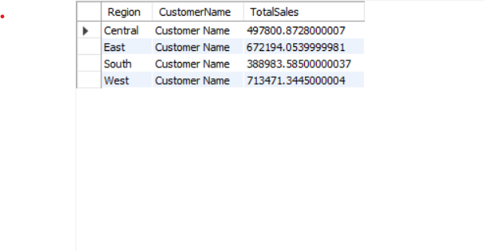

# Superstore Sales Analysis – Kathryn Starkey  

## Overview  
This project analyzes retail sales data from the **Superstore dataset** to demonstrate SQL querying, data transformation, and dashboard visualization skills.  
It focuses on building an end-to-end data workflow — from importing raw CSV data into MySQL, to performing analytics and visualizing trends in Power BI.

---

## Objectives  
- Create reproducible SQL queries for aggregation, filtering, and ranking.  
- Transform and validate data for accurate reporting.  
- Design a Power BI dashboard for key business insights (sales, profit, discount).  
- Establish a structure that can scale to Snowflake or Azure environments.  

---

## Tools & Technologies  
| Category | Tools |
|-----------|-------|
| Querying | MySQL |
| Visualization | Power BI |
| Data Source | Superstore CSV dataset |
| Version Control | GitHub |
| Cloud Integration | Snowflake + Azure Data Factory (staging & monitoring) |

---


## Data Import Process  
The dataset was imported using two reproducible methods:  
- **Import Wizard:** MySQL Workbench quick load for initial testing.  
- **SQL Script:** Using `LOAD DATA INFILE` for repeatable pipeline setup.

```sql
LOAD DATA LOCAL INFILE 'C:/Users/Kathryn/Documents/SampleSuperstore.csv'
INTO TABLE orders
FIELDS TERMINATED BY ','
ENCLOSED BY '"'
LINES TERMINATED BY '\n'
IGNORE 1 ROWS;
```

---

## SQL Analysis Highlights
Analytical focus areas:

- Top-performing categories and subcategories
- Customer segmentation by region and purchase frequency
- Discount-to-profit correlation
- Monthly sales and growth trends

🗂️ Queries → /queries      
📊 Results & screenshots → /results 

---

## Power BI Dashboard
Features:

- Total sales, profit, and discount metrics
- Regional and category-level profitability
- Top customers and products
- Dynamic filtering for interactive analysis

📁 .pbix file → /powerbi     
🖼️ Image preview → /results

---

## Project Structure
Superstore_Analysis/
│
├── data/           # Raw Superstore CSV dataset
├── queries/        # SQL scripts (joins, aggregations, ranking)
├── results/        # Query results and Power BI visuals
├── powerbi/        # Power BI .pbix file
└── README.md       # Project documentation

---

📘 ## Appendix: Sample Queries & Outputs

## 1. Top 10 Customers by Total Sales

```sql
SELECT `Customer Name`, SUM(Sales) AS Total_Sales
FROM superstore.orders
GROUP BY `Customer Name`
ORDER BY Total_Sales DESC
LIMIT 10;
```

**Result Screenshot:**      



## 2. Total Profit by Category

```sql
SELECT Category, SUM(Profit) AS Total_Profit
FROM superstore.orders
GROUP BY Category
ORDER BY Total_Profit DESC;
```

**Result Screenshot:**       


## 3. Monthly Sales Trend

```sql
SELECT DATE_FORMAT(`Order Date`, '%Y-%m') AS Month,
		SUM(Sales) AS Monthly_Sales
FROM superstore.orders
GROUP BY Month 
ORDER BY Month;
```
**Result Screenshot:**      


## 4. Top 5 Products by Quantity Sold (Subquery)

```sql
SELECT Product_Name, Total_Quantity
FROM (
    SELECT `Product Name` AS Product_Name,
           SUM(Quantity) AS Total_Quantity,
           ROW_NUMBER() OVER (ORDER BY SUM(Quantity) DESC) AS rn
    FROM superstore.orders
    GROUP BY `Product Name`
) ranked
WHERE rn <= 5;
```

**Result Screenshot:**      


## 5. Regions with Negative Profit

```sql
SELECT Region, SUM(Profit) AS Total_Profit
FROM superstore.orders
GROUP BY Region
HAVING Total_Profit < 0
ORDER BY  Total_Profit ASC;
```

**Result Screenshot:**     


## 6. Top 3 Customers by Region (Window Function)

```sql
WITH Customer_Sales AS (
    SELECT 
        Region,
        `Customer Name` AS Customer_Name,
        SUM(Sales) AS Total_Sales
    FROM orders
    GROUP BY Region, `Customer Name`
)
SELECT Region, Customer_Name, Total_Sales
FROM (
    SELECT 
        Region,
        Customer_Name,
        Total_Sales,
        ROW_NUMBER() OVER (PARTITION BY Region ORDER BY Total_Sales DESC) AS rn
    FROM Customer_Sales
) ranked
WHERE rn <= 3
ORDER BY Region, rn;
```

**Result Screenshot:**     


---

Author: Kathryn Starkey    
📧 kathrynstarkey.data@gmail.com    
🌐 GitHub Portfolio
